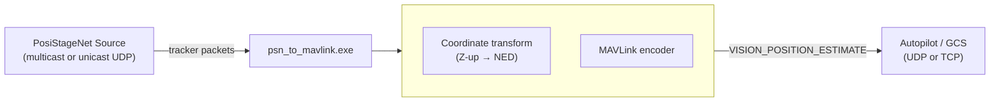

# PSN2MAVLink

PSN2MAVLink is a lightweight bridge between PosiStageNet (PSN) tracking feeds and MAVLink-enabled autopilots. It listens for PSN multicast/unicast packets, converts tracker poses into `VISION_POSITION_ESTIMATE` messages, and streams them to ArduPilot, PX4, or any GCS that understands MAVLink. Use it to expose UWB anchor/tag localisation data to drones in real time.

---

## Features

- **Protocol broker:** ingests PSN tracker updates and republishes them as MAVLink pose messages.
- **UDP or TCP egress:** send MAVLink packets via stateless UDP or maintain a TCP uplink for ground stations such as MAVProxy.
- **Z-up to NED conversion:** converts PSN’s Z-up frame to MAVLink’s North-East-Down by default (toggle with `--no-ned`).
- **Multicast/unicast flexibility:** subscribe to theatre networks, simulators, or loopback feeds; specify the network interface when needed.
- **Zero external runtime deps:** single C++17 executable built against the upstream `c_library_v2` headers.

---

## Architecture



---

## Requirements

| Component | Notes |
|-----------|-------|
| C++ toolchain | Any C++17-capable compiler (MSVC, Clang, GCC) |
| CMake | Version 3.10 or newer |
| MAVLink headers | Provide a checkout of [`mavlink/c_library_v2`](https://github.com/mavlink/c_library_v2) via submodule or download |
| Python (optional) | Required for the included PSN simulator and MAVLink sanity-check scripts |

> � **Tip (Windows):** run builds from a Developer Command Prompt or a shell that exposes the MSVC toolchain, or install the MSYS2/MinGW toolset.

---

## Getting started

```powershell
# Clone your fork with submodules
git clone --recurse-submodules https://github.com/OmerMersin/PSN2MAVLink.git
cd PSN2MAVLink

# Configure (point MAVLINK_INCLUDE_DIR at the c_library_v2 checkout when not using submodules)
cmake -B build -S . -DMAVLINK_INCLUDE_DIR="${PWD}/c_library_v2"

# Build
cmake --build build --config Release
```

The resulting executable lives at `build/psn_to_mavlink.exe` on Windows (or `build/psn_to_mavlink` on Linux/macOS).

---

## Runtime configuration

```powershell
psn_to_mavlink --group 236.10.10.10 --port 56565 `
               --mav-ip 127.0.0.1 --mav-port 14550 `
               [--mav-transport udp|tcp] [--iface 192.168.0.X] `
               [--sysid 245] [--compid 200] [--tracker <id>] `
               [--no-ned] [--unicast]
```

| Flag | Default | Description |
|------|---------|-------------|
| `--group` | `236.10.10.10` | Multicast or unicast address that carries PSN traffic |
| `--port` | `56565` | UDP port for PSN packets (avoid Windows-excluded ranges) |
| `--iface` | (auto) | IPv4 interface to use when joining multicast |
| `--mav-ip` | `127.0.0.1` | Destination host for MAVLink output |
| `--mav-port` | `14550` | Destination port (UDP send or TCP connect) |
| `--mav-transport` | `udp` | Choose `udp` for sendto; `tcp` for a persistent socket |
| `--sysid` / `--compid` | `245` / `200` | System and component IDs in the MAVLink header |
| `--tracker` | (all) | Restrict output to a single PSN tracker ID |
| `--no-ned` | disabled | Leave Z untouched (PSN Z-up) instead of converting to NED |
| `--unicast` | auto | Skip multicast join, useful for loopback generators |
| `--help` | – | Print the usage summary |

---

## Typical workflows

### 1. Loopback simulation (UDP ➜ ArduPilot SITL)

```powershell
# Terminal 1 – emit synthetic PSN packets
python psn_sim.py --unicast --group 127.0.0.1 --port 60000 --tracker 1 --rate 30

# Terminal 2 – bridge to MAVLink UDP
./build/psn_to_mavlink.exe --unicast --group 127.0.0.1 --port 60000 `
    --mav-ip 127.0.0.1 --mav-port 14550 --mav-transport udp
```

Connect Mission Planner, QGroundControl, or MAVProxy to UDP port `14550` to see live `VISION_POSITION_ESTIMATE` updates.

### 2. Streaming to a TCP-only ground station (e.g. MAVProxy on 5762)

```powershell
python psn_sim.py --unicast --group 127.0.0.1 --port 60000 --tracker 1
./build/psn_to_mavlink.exe --group 127.0.0.1 --port 60000 --unicast `
    --mav-ip 127.0.0.1 --mav-port 5762 --mav-transport tcp
```

The bridge initiates a TCP connection to `127.0.0.1:5762` and pushes MAVLink frames over that channel.

---

## Coordinate frame notes

- PSN reports **X/Y in the stage plane** with **Z up**.
- MAVLink’s `VISION_POSITION_ESTIMATE` expects **North-East-Down**, where Z negative means “up”.
- By default the bridge flips the Z-axis (`--no-ned` disables the flip if your consumer already expects Z-up).

---

## Included utilities

| Script | Purpose |
|--------|---------|
| `psn_sim.py` | Emits circular-motion PSN packets for bench testing |
| `check_vision_position_estimate.py` | Sends canned MAVLink poses over TCP to verify your autopilot pipeline |

Use them together to validate networking and coordinate transforms before heading to the field.

---

## Troubleshooting

- **`bind failed: 10013` (Windows)** – the OS reserves certain UDP ports. Check `netsh interface ipv4 show excludedportrange protocol=udp` and pick a free value (e.g. `60000`).
- **`IP_ADD_MEMBERSHIP failed`** – ensure the address is within the multicast range (224.0.0.0/4) and that the selected NIC can reach it; otherwise run with `--unicast`.
- **No MAVLink traffic on the receiver** – double-check firewall rules, confirm the transport mode, and sniff the destination using `mavutil.mavlink_connection()` or Wireshark.
- **TCP link drops** – the bridge exits on hard socket errors so you can restart it once the ground station becomes reachable again.

---

## Roadmap

- Emit `VISION_SPEED_ESTIMATE` when PSN velocity chunks are present.
- Provide configurable covariance presets.
- Add packaging scripts for Windows/macOS releases.
- Integrate CI builds and static analysis.

Contributions and pull requests are very welcome!

---

## License

PSN2MAVLink is released under the [MIT License](./LICENSE). See the LICENSE file for the full text.
